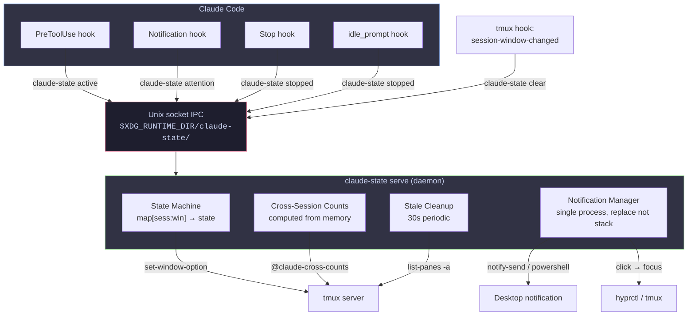
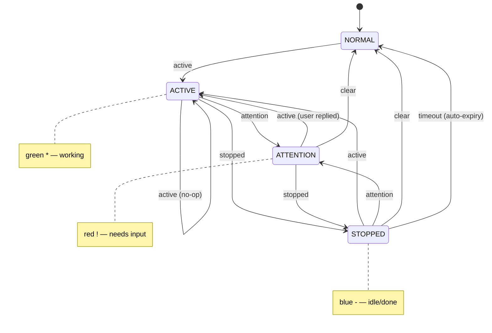

# Architecture

## Overview

The plugin is built around a single Go binary (`claude-state`) that acts as both a client and a daemon:



## State Machine



Priority: **ATTENTION > ACTIVE > STOPPED > NORMAL**

All transitions go through the daemon's state machine. The daemon holds the lock, updates the in-memory map, then applies the change to tmux in a single batched IPC call.

A post-transition race guard in `setActive` re-checks the state after writing to tmux — if `setAttention` ran concurrently, the attention format is restored.

## Binary Modes

### Client mode (`claude-state <verb>`)

1. Drains stdin (Claude Code hooks pipe JSON to stdin)
2. Reads `$TMUX` and `$TMUX_PANE` from environment
3. Single `tmux display-message` call to resolve session:window
4. Connects to daemon socket, sends JSON, reads response, exits
5. If socket doesn't exist, starts daemon (`claude-state serve` in new session)

Total wall time: ~1ms (warm), ~300ms (cold start with daemon launch).

### Daemon mode (`claude-state serve`)

Long-lived process managing:

| Responsibility | How |
|---|---|
| State transitions | In-memory `map[string]*trackedWindow`, mutex-protected |
| tmux markers | Batched `tmux set-window-option` calls with `;` chaining |
| Cross-session counts | Computed from in-memory state, pushed to `@claude-cross-counts` |
| Stale cleanup | 30s ticker, checks `tmux list-panes -a` for Claude processes |
| Desktop notifications | Single `notify-send` process with `-r` (replace), killed on new request |
| Done popup | `time.AfterFunc` clears `@claude-done-msg` after 5s |
| Stopped expiry | Optional `@claude-stopped-timeout` clears marker after N seconds |

Auto-exits after 10 minutes of no client activity.

## IPC Protocol

Client sends a single JSON line over the unix socket:

```json
{
  "type": "active",
  "session": "main",
  "window": "3",
  "pane_id": "%42",
  "pane_idx": "1",
  "workspace": "2",
  "window_addr": "0x5678abcd",
  "tmux_socket": "/tmp/tmux-1000/default,3226,0"
}
```

Daemon responds with `{"ok":true}\n` or `{"ok":false}\n`.

All fields are validated: session names must match `[a-zA-Z0-9_./-]`, window indices must be digits, pane IDs must match `%\d+`, tmux socket must match the expected path format.

## Security

- **Socket path**: `$XDG_RUNTIME_DIR/claude-state/` (per-user, falls back to `/tmp/claude-state-$UID/`)
- **Socket permissions**: Created with `umask(0077)`, then `chmod 0600`
- **Input validation**: Regex-based on all JSON fields, type allowlist, length limits
- **Rate limiting**: Connection semaphore (50 concurrent), map cap (500 windows)
- **No shell interpolation**: All external commands use `exec.Command` (no shell)
- **PowerShell**: Body passed via stdin with single-quote escaping; `validName` regex blocks `'`

## Session Dashboard Popup

`popup.sh` runs inside `tmux display-popup -E` when the user presses the configured key. It:

1. Calls `tmux list-panes -a` to find all windows with a Claude process
2. Calls `tmux list-windows -a` to read state markers and window names
3. Formats each Claude window with ANSI-colored state icons
4. Pipes to `fzf --ansi` with a live `capture-pane` preview
5. On selection: `tmux switch-client -t session:window`

## Hook Registration

Hooks use explicit array indices (`[100]`) instead of `-ga` (global append):

```bash
tmux set-hook -g 'session-window-changed[100]' "run-shell -b 'claude-state clear'"
tmux set-hook -g 'client-session-changed[100]' "run-shell -b 'claude-state clear'"
```

Reloading replaces the same index rather than appending duplicates. Old v1 hooks at indices 0-5 are cleaned up on load.

## State Storage

Primary state lives in the daemon's in-memory map. It is mirrored to tmux window options for display:

| Option | Scope | Values | Purpose |
|--------|-------|--------|---------|
| `@claude-active` | per-window | `1` or unset | Claude is actively working |
| `@claude-attention` | per-window | `1` or unset | Claude needs user attention |
| `@claude-stopped` | per-window | `1` or unset | Claude has stopped |
| `window-status-format` | per-window override | format string | Visual color change |
| `@claude-cross-counts` | global | tmux format string | Cross-session count display |
| `@claude-done-msg` | global | tmux format string | Temporary "done" indicator |

The daemon is the source of truth. tmux options are write-only from the daemon's perspective — used for rendering, not for state queries.

## Themes

Four bundled themes in `themes/`. Each sets:
- Status bar structure and colors
- Window label formats (purple for selected, theme colors for normal)
- Plugin defaults (`@claude-window-bg`, `@claude-active-color`, `@claude-attention-color`, `@claude-stopped-color`)

## Design Decisions

### Why a daemon instead of per-hook scripts?

The original shell-script approach had each hook (active/notify/stopped) making 3-5 tmux IPC calls, spawning background processes for counts and notifications, and polling for stale markers. This caused:
- 441+ zombie `notify-send` processes from desktop notifications
- Redundant `tmux list-windows -a` calls on every state change
- Race conditions between concurrent hook invocations
- Background `sleep` processes for done popup and stopped expiry

The daemon centralizes all state, eliminates polling, and manages notification lifecycle.

### Why Go?

- Single static binary, no runtime dependencies
- Fast client mode (~1ms), well within Claude Code's 5s hook timeout
- Good concurrency primitives (goroutines, mutexes, channels)
- Cross-compiles easily for distribution

### Why tmux options as state mirror?

- Atomic: tmux handles display concurrency
- No cleanup needed: options live with the window
- The daemon writes them; tmux reads them for rendering

### Why indexed hooks instead of `-ga`?

`-ga` appends on every reload, causing duplicates. Indexed hooks (`[100]`) are idempotent.

### Why `PreToolUse` for active state?

It fires whenever Claude uses a tool, reliably indicating active work. The daemon short-circuits if already in `stateActive` — subsequent calls are a single socket write.
